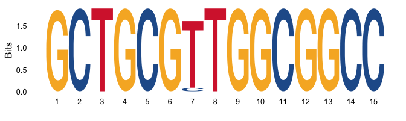

<!-- README.md is generated from README.Rmd. Please edit that file -->

# ptmismatch 

<!-- badges: start -->
<!-- badges: end -->

The goal of ptmismatch (primer-template mismatch) is to find and
summarize primer binding sites within a given set of sequences to
estimate priming efficiency during a polymerase chain reaction (PCR).

## Installation

You can install the development version of ptmismatch from
[GitHub](https://github.com/) with:

``` r
# install.packages("devtools")
devtools::install_github("medvir/ptmismatch")
```

## Example

To find and list all primer-template matches, ptmismatch contains the
function `summarize_matches()`. Load the package and open the
documentation as follows:

``` r
library(ptmismatch)

?summarize_matches()
```

A primer (or pattern) and template (or subject) sequence is required.
The primer sequence can be provided as string. [IUPAC ambiguity
codes](https://www.bioinformatics.org/sms/iupac.html) are supported
(e.g. “R” matches “A” and “G”). “I” are not supported, replace them with
“N” instead.

The template sequence(s) can be provided in form of a fasta or fastq
file. Ns in the template count as mismatch but all other ambiguity codes
not.

``` r
EV_fwd <- "GCTGCGYTGGCGGCC"

EV_sequences_fasta <- system.file("extdata", "Enterovirus_12059.fasta",
                                  package = "ptmismatch")
```

Search for the pattern:

``` r
matches_summary <-
  summarize_matches(pattern = EV_fwd, subject_filepath = EV_sequences_fasta,
                    subject_format = "fasta", max.mismatch = 1, with.indels = TRUE)
#> using Gonnet

matches_summary
#> # A tibble: 20 × 7
#>    seqID       pattern         strand start   end matched         matched_alig…¹
#>    <chr>       <chr>           <chr>  <int> <dbl> <chr>           <chr>         
#>  1 GQ865517.1  GCTGCGYTGGCGGCC +        359   372 CTGCGTTGGCGGCC  -CTGCGTTGGCGG…
#>  2 JN542510.1  GCTGCGYTGGCGGCC +        361   375 GCTGCGTTGGCGGCC GCTGCGTTGGCGG…
#>  3 JX514942.1  GCTGCGYTGGCGGCC +        340   354 GCTGCGTTGGCGGCC GCTGCGTTGGCGG…
#>  4 JX393302.1  GCTGCGYTGGCGGCC +        332   345 CTGCGTTGGCGGCC  -CTGCGTTGGCGG…
#>  5 JX961708.1  GCTGCGYTGGCGGCC +        360   373 CTGCGTTGGCGGCC  -CTGCGTTGGCGG…
#>  6 KC344833.1  GCTGCGYTGGCGGCC +        308   322 GCTGCGTTGGCGGCC GCTGCGTTGGCGG…
#>  7 KC785528.1  GCTGCGYTGGCGGCC +        316   330 GCTGCGTTGGCGGCC GCTGCGTTGGCGG…
#>  8 KC785530.1  GCTGCGYTGGCGGCC +        297   311 GCTGCGTTGGCGGCC GCTGCGTTGGCGG…
#>  9 KF990476.1  GCTGCGYTGGCGGCC +        362   376 GCTGCGCTGGCGGCC GCTGCGCTGGCGG…
#> 10 KF312882.1  GCTGCGYTGGCGGCC +        362   376 GCTGCGTTGGCGGCC GCTGCGTTGGCGG…
#> 11 KJ420749.1  GCTGCGYTGGCGGCC +        362   376 GCTGCGTTGGCGGCC GCTGCGTTGGCGG…
#> 12 NC_024073.1 GCTGCGYTGGCGGCC +        362   376 GCTGCGTTGGCGGCC GCTGCGTTGGCGG…
#> 13 KU587555.1  GCTGCGYTGGCGGCC +        378   391 CTGCGTTGGCGGCC  -CTGCGTTGGCGG…
#> 14 NC_029905.1 GCTGCGYTGGCGGCC +        378   391 CTGCGTTGGCGGCC  -CTGCGTTGGCGG…
#> 15 KU355876.1  GCTGCGYTGGCGGCC +        367   381 GCTGCGTTGGCGGCC GCTGCGTTGGCGG…
#> 16 KU355877.1  GCTGCGYTGGCGGCC +        364   378 GCTGCGTTGGCGGCC GCTGCGTTGGCGG…
#> 17 NC_030454.1 GCTGCGYTGGCGGCC +        367   381 GCTGCGTTGGCGGCC GCTGCGTTGGCGG…
#> 18 NC_038306.1 GCTGCGYTGGCGGCC +        362   376 GCTGCGTTGGCGGCC GCTGCGTTGGCGG…
#> 19 NC_038307.1 GCTGCGYTGGCGGCC +        362   376 GCTGCGTTGGCGGCC GCTGCGTTGGCGG…
#> 20 NC_038308.1 GCTGCGYTGGCGGCC +        360   374 GCTGCGTTGGCGGCC GCTGCGTTGGCGG…
#> # … with abbreviated variable name ¹​matched_aligned
```

The matches found can then be visualised for example as a sequence logo
plog using the ggseqlogo package:

``` r
ggseqlogo::ggseqlogo(matches_summary$matched_aligned, method = "bits",
                     seq_type = "dna")
```



In this example it nicely shows that the `Y` at position 7 of the primer
is justified by the occurrence of `T` and `C` at that position.
